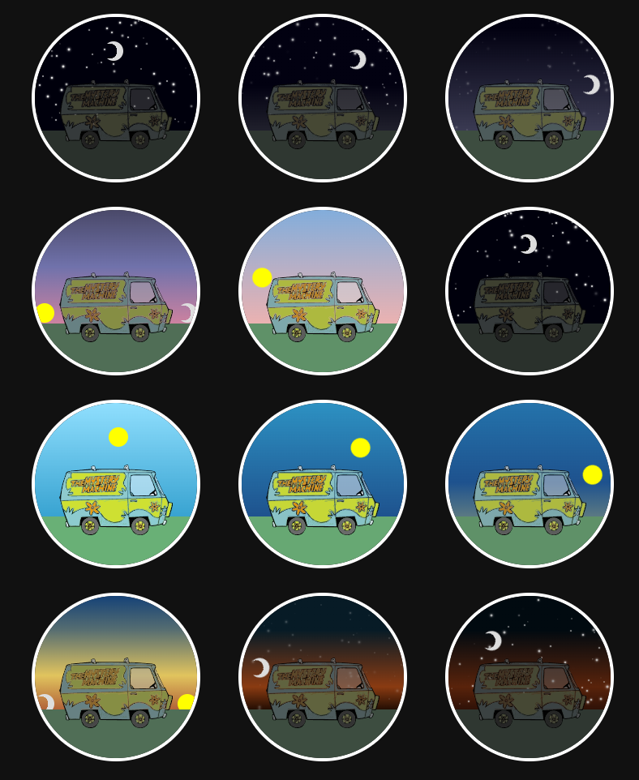

# GoctiTimeGizmo, a SugarCube macro

GoctiTimeGizmo is a [SugarCube](https://www.motoslave.net/sugarcube/2/) macro and gives you a time-indicator 'gizmo' for use in your games. When you use this macro, you get a little scene that corresponds to the time of day that you provide.

In the example image below you see a van ("The Mystery Machine"), that van is just an example however; and can be whatever you would like / fits the theme for your game.

## What does it look like?

In the image below, there are 12 separate uses of the macro, each with a different time of day having been set.



## How do I add this macro to my game?

1. Copy the contents of <a href="https://raw.githubusercontent.com/Goctionni/sugarcube-time-gizmo/main/macro.js" download>macro.js</a> into your game's Javascript.
2. Copy the contents of <a href="https://raw.githubusercontent.com/Goctionni/sugarcube-time-gizmo/main/style.css" download>style.css</a> into your game's stylesheet.
3. Use the macro!

## How do I use this macro?

Whereever you want to use this macro, use this code:

```
<<GoctiTimeGizmo "12:00">>
  CONTENT_HERE
<</GoctiTimeGizmo>>
```

### Time format

In this code-sample, obviously the time is a string `12:00`, however many other time formats are also supported.

Examples:
* string in `hh:mm` format
* the colon can be omitted like `"1200"`
* numbers do not need to have leading zeros, `"70"` would be parsed as 7 hours and 0 minutes.
* string formats with am/pm work (`"7:30 am"`)
* javascript `Date` objects are supported
* unix-timestamp (in ms) are supported
* object like `{hours: 17, minutes: 10}` work
* optionally with am/pm: `{hours: 5, minutes: 10, extra: 'pm'}`

## CONTENT_HERE?

Instead of CONTENT_HERE, you can place any HTML you'd like. For example, you can use an image like ``. or any other HTML you would like, whether it is one element or multiple.

Want to just use the mystery-machine as in the example?

You can either download the <a href="https://raw.githubusercontent.com/Goctionni/sugarcube-time-gizmo/main/mystery-machine.svg" download>mystery-machine.svg</a> and use a regular html ``, or copy the contents of that file into a new SugarCube passage and use `<<include 'MysteryMachine svg Passage'>>`.

## What does the macro actually do?

* It places the sun and moon at the appropriate place in the sky
* It transitions the background to be the appropriate gradient
* It places twinkling stars in the sky at night
* It darkens and desaturates the visuals appropriately for the time of day

## Credits

* [Sjoerd Hekking](https://github.com/SjoerdHekking) created the mystery-machine SVG image.
* I got the beautiful color gradients for the horizon from this [Codepen by Peter Bork](https://codepen.io/bork/pen/WNrmWr).

## Further customization

If you like, there's some CSS variables you can easily customize.
The values listed below are the defaults.

```css
:root {
  /*
    --gtg-moon-shadow-progress
    Determines where the shadow is centered, from left to right.
    Where 0% is the center and -50% and 50% are the left and right
    ends.
  */
  --gtg-moon-shadow-progress: -35%;

  /*
    --gtg-moon-shadow-size
    Determines the size of shadow, relative to the size of the moon
    itself.
  */
  --gtg-moon-shadow-size: 65%;

  /*
    --gtg-grass-color
    The color of the grass.
  */
  --gtg-grass-color: #69B076;

  /*
    --gtg-size
    The size of the gizmo.
  */
  --gtg-size: 200px;
}
```
